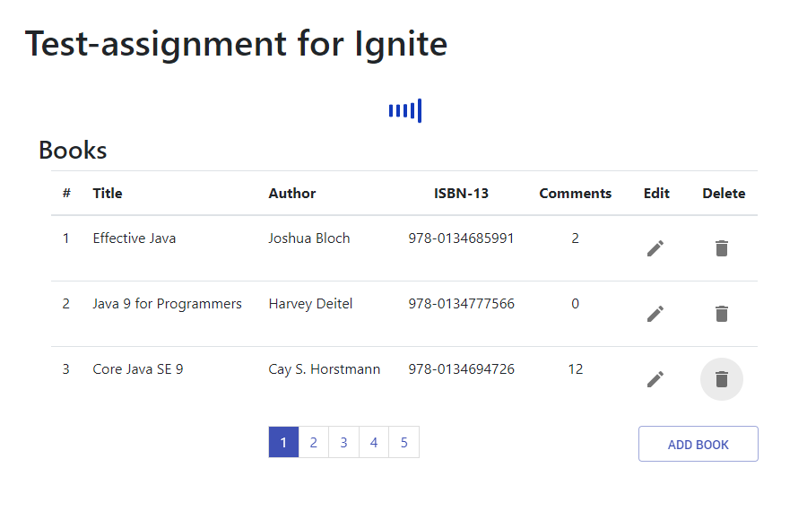
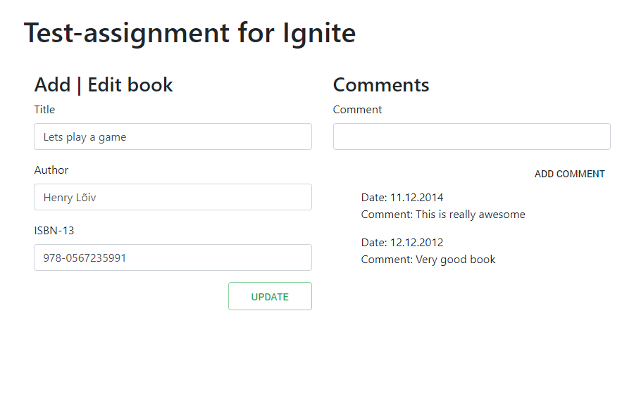

# Books Management project using React and Spring API

Technologies used: React.js, Axios, Spring Boot, H2 database, JPA, Node.js, Maven

## Installation
Make sure you have Java JDK installed
Open up your favorite terminal and write,
`git clone https://github.com/GlamourDev/books-management.git`

### In order to run this project [several options]
1. `mvn clean install` on the root of project
2. RunMe.cmd [Windows only] option to build and run
3. Compiled jar, double click on it and go to http://localhost:8080/ on your browser

**Note: React uses _localhost:3000_ and Spring API uses _localhost:8080_. In order to run both of them, the ports 8080 and 3000 must be accessible and usable.**